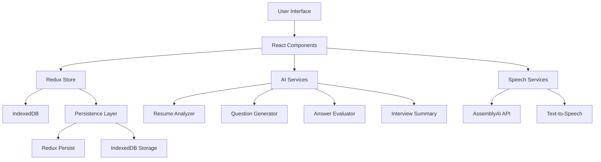

# 🤖 AI-Interviewer

<div align="center">

**An intelligent, AI-powered interview assistant that conducts automated technical interviews with real-time evaluation and comprehensive candidate management.**

[](https://reactjs.org/)
[](https://www.typescriptlang.org/)
[](https://vitejs.dev/)
[](https://tailwindcss.com/)

[🚀 Live Demo](#-live-demo) • [📖 Documentation](#-documentation) • [🛠️ Local Setup](#-local-setup)

</div>

---

## 📋 Table of Contents

- [🎯 Overview](#-overview)
- [✨ Features](#-features)
- [🏗️ Architecture](#️-architecture)
- [🛠️ Local Setup](#-local-setup)
- [📖 Usage Guide](#-usage-guide)
- [📁 Project Structure](#-project-structure)
- [🔧 Technologies Used](#-technologies-used)
- [🔑 API Configuration](#-api-configuration)
- [🎨 UI Components](#-ui-components)
- [📊 State Management](#-state-management)
- [🙏 Acknowledgments](#-acknowledgments)

---

## 🎯 Overview

AI-Interviewer is a sophisticated web application that revolutionizes the technical interview process by leveraging artificial intelligence to conduct automated interviews. The platform provides a dual-interface system where candidates can participate in AI-guided interviews while interviewers can monitor and evaluate candidates through a comprehensive dashboard.

### 🎯 Key Objectives

- **Automated Interview Process**: Conduct structured technical interviews with AI-generated questions
- **Real-time Evaluation**: Provide instant feedback and scoring during interviews
- **Candidate Management**: Comprehensive dashboard for tracking and evaluating candidates
- **Resume Analysis**: Intelligent extraction and analysis of candidate information
- **Persistent Data**: Maintain interview progress across sessions
- **Voice Integration**: Support for voice input and text-to-speech functionality

---

## ✨ Features

### 🎤 **Interviewee Experience**
- **📄 Resume Upload**: Support for PDF and DOCX file formats
- **🔍 Smart Data Extraction**: Automatic extraction of Name, Email, and Phone from resumes
- **💬 Interactive Chat Interface**: Real-time conversation with AI interviewer
- **⏱️ Timed Questions**: Structured question flow with appropriate time limits
- **🎙️ Voice Input**: Speech-to-text functionality for natural interaction
- **📊 Progress Tracking**: Visual progress indicators and question counters
- **💾 Session Persistence**: Resume interviews after page refresh or closure

### 📊 **Interviewer Dashboard**
- **👥 Candidate Management**: Comprehensive list of all candidates
- **📈 Scoring System**: AI-powered evaluation and ranking
- **🔍 Detailed Analytics**: Individual candidate performance analysis
- **📋 Interview History**: Complete record of questions, answers, and evaluations
- **🔎 Search & Filter**: Advanced candidate search and filtering capabilities
- **📊 Performance Metrics**: Statistical insights and reporting

### 🤖 **AI-Powered Features**
- **🧠 Intelligent Question Generation**: Dynamic question creation based on role and difficulty
- **📝 Answer Evaluation**: Real-time assessment of candidate responses
- **📊 Scoring Algorithm**: Comprehensive scoring system with detailed feedback
- **📋 Interview Summaries**: AI-generated candidate summaries and recommendations
- **🎯 Resume Analysis**: Deep analysis of candidate qualifications and experience

### 🔧 **Technical Features**
- **💾 Local Data Persistence**: IndexedDB for reliable data storage
- **🔄 Real-time Synchronization**: Seamless data sync between interfaces
- **📱 Responsive Design**: Optimized for desktop and mobile devices
- **🎨 Modern UI**: Clean, intuitive interface built with shadcn/ui
- **⚡ Performance Optimized**: Fast loading and smooth user experience

---

## 🏗️ Architecture



---

## 🛠️ Local Setup

### Prerequisites

- **Node.js** (v18.0.0 or higher)
- **npm** (v8.0.0 or higher) or **yarn** (v1.22.0 or higher)
- **Git** (for cloning the repository)

### 📥 Clone the Repository

```bash
git clone https://github.com/your-username/ai-interviewer.git
cd ai-interviewer/chat-ai-interviewer
```

### 📦 Install Dependencies

```bash
# Using npm
npm install

# Using yarn
yarn install

# Using pnpm
pnpm install
```

### 🔑 Environment Setup

Create a `.env` file in the `chat-ai-interviewer` directory:

```bash
# Required for voice input functionality
VITE_ASSEMBLYAI_API_KEY=your_assemblyai_api_key_here
```

> **Note**: The application works without API keys but with limited voice functionality. See [API Configuration](#-api-configuration) for detailed setup instructions.

### 🚀 Start Development Server

```bash
npm run dev
```

### 🌐 Access the Application

Open your browser and navigate to `http://localhost:8080`

### ⚙️ Configure API Keys (Optional)

If you haven't set up API keys, the application will prompt you to configure them for full functionality.

### 🎯 Begin Interview Process

1. **As a Candidate**: Upload your resume and start the interview
2. **As an Interviewer**: Monitor candidates through the dashboard

---

## 📖 Usage Guide

### 👤 **For Candidates**

#### Step 1: Resume Upload
1. Navigate to the **Interviewee** tab
2. Upload your resume (PDF or DOCX format)
3. Review and complete any missing information

#### Step 2: Interview Process
1. Answer AI-generated questions within the time limit
2. Use voice input or text input for responses
3. Monitor your progress through the interview

#### Step 3: Completion
1. Review your interview summary
2. Access your performance metrics
3. Download or share your results

### 👨‍💼 **For Interviewers**

#### Step 1: Dashboard Access
1. Navigate to the **Interviewer** tab
2. View the candidate list sorted by performance
3. Access detailed candidate information

#### Step 2: Candidate Analysis
1. Click on any candidate to view their profile
2. Review interview history and responses
3. Analyze AI-generated evaluations and scores

#### Step 3: Management
1. Search and filter candidates
2. Export candidate data
3. Generate performance reports

---

## 📁 Project Structure

```
chat-ai-interviewer/
├── 📁 public/                     # Static assets
│   ├── interview.svg             # Application logo
│   └── robots.txt                # SEO configuration
├── 📁 src/                        # Source code
│   ├── 📁 api/                    # API configuration
│   │   └── aa-token.ts           # AssemblyAI token management
│   ├── 📁 components/             # React components
│   │   ├── 📁 dashboard/          # Interviewer dashboard components
│   │   ├── 📁 interview/          # Interview flow components
│   │   ├── 📁 ui/                 # Reusable UI components
│   │   ├── ApiKeyValidator.tsx    # API key configuration
│   │   ├── IntervieweeTab.tsx    # Candidate interface
│   │   ├── InterviewerTab.tsx    # Interviewer interface
│   │   └── TabLayout.tsx          # Main layout component
│   ├── 📁 config/                 # Configuration files
│   │   └── api.ts                # API configuration
│   ├── 📁 hooks/                  # Custom React hooks
│   │   ├── use-mobile.tsx        # Mobile detection hook
│   │   └── use-toast.ts          # Toast notification hook
│   ├── 📁 lib/                    # Utility libraries
│   │   └── utils.ts              # Common utilities
│   ├── 📁 pages/                  # Application pages
│   │   ├── Index.tsx             # Main application page
│   │   └── NotFound.tsx          # 404 error page
│   ├── 📁 services/               # Business logic services
│   │   ├── 📁 ai/                # AI service implementations
│   │   │   ├── BaseAIService.ts  # Base AI service class
│   │   │   ├── ResumeAnalyzer.ts  # Resume analysis service
│   │   │   ├── QuestionGenerator.ts # Question generation service
│   │   │   ├── AnswerEvaluator.ts # Answer evaluation service
│   │   │   ├── TTSService.ts     # Text-to-speech service
│   │   │   └── InterviewSummary.ts # Interview summary service
│   │   ├── aiService.ts          # AI service orchestrator
│   │   ├── indexedDBService.ts   # Database service
│   │   └── speechService.ts      # Speech processing service
│   ├── 📁 store/                  # State management
│   │   ├── 📁 slices/            # Redux slices
│   │   │   ├── candidatesSlice.ts # Candidate state management
│   │   │   └── interviewSlice.ts  # Interview state management
│   │   └── store.ts              # Redux store configuration
│   ├── App.tsx                    # Main application component
│   ├── App.css                    # Global styles
│   ├── index.css                  # Tailwind CSS imports
│   └── main.tsx                   # Application entry point
├── 📄 package.json                # Dependencies and scripts
├── 📄 vite.config.ts              # Vite configuration
├── 📄 tailwind.config.ts          # Tailwind CSS configuration
├── 📄 tsconfig.json               # TypeScript configuration
└── 📄 README.md                   # Project documentation
```

---

## 🔧 Technologies Used

### **Frontend Framework**
- **React 18.3.1** - Modern React with hooks and concurrent features
- **TypeScript 5.8.3** - Type-safe JavaScript development
- **Vite 5.4.19** - Fast build tool and development server

### **UI & Styling**
- **Tailwind CSS 3.4.17** - Utility-first CSS framework
- **shadcn/ui** - Modern, accessible component library
- **Radix UI** - Unstyled, accessible UI primitives
- **Lucide React** - Beautiful, customizable icons

### **State Management**
- **Redux Toolkit 2.9.0** - Predictable state container
- **Redux Persist 6.0.0** - State persistence
- **React Redux 9.2.0** - React bindings for Redux

### **Data & Storage**
- **IndexedDB** - Client-side database for persistence
- **idb 8.0.3** - IndexedDB wrapper library
- **TanStack Query 5.83.0** - Data fetching and caching

### **AI & Speech Services**
- **AssemblyAI 4.16.1** - Speech-to-text API
- **Puter AI** - AI services for analysis and generation 
- **Web Speech API** - Browser speech recognition

### **File Processing**
- **PDF-Parse 1.1.1** - PDF text extraction
- **AI-based Analysis** - Direct file analysis via Puter AI (no text extraction needed)

### **Audio & Communication**
- **mic 2.1.2** - Microphone access
- **node-record-lpcm16 1.0.1** - Audio recording
- **ws 8.18.0** - WebSocket client for real-time communication

### **Development Tools**
- **ESLint 9.32.0** - Code linting and formatting
- **PostCSS 8.5.6** - CSS processing
- **Autoprefixer 10.4.21** - CSS vendor prefixing

---

## 🔑 API Configuration

### **Required API Keys**

| Service | Purpose | Cost | Required |
|---------|---------|------|----------|
| **AssemblyAI** | Speech-to-text functionality | Free tier available | Optional |
| **Puter AI** | Resume analysis, question generation, evaluation | Free | No API key needed |

### **Setup Instructions**

#### 1. **AssemblyAI Setup** (Optional)
```bash
# Get your API key from https://www.assemblyai.com/
# Add to .env file
VITE_ASSEMBLYAI_API_KEY=your_api_key_here
```

#### 2. **Puter AI Setup** (Automatic)
- No API key required
- Loaded automatically via CDN script in `index.html`
- Provides all AI functionality (resume analysis, question generation, evaluation, TTS)

### **Feature Matrix**

| Feature | Without AssemblyAI | With AssemblyAI |
|---------|-------------------|-----------------|
| Text Input | ✅ | ✅ |
| Voice Input | ❌ | ✅ |
| Resume Analysis | ✅ | ✅ |
| Question Generation | ✅ | ✅ |
| Answer Evaluation | ✅ | ✅ |
| Interview Summaries | ✅ | ✅ |

---

## 🎨 UI Components

The application uses a comprehensive set of UI components built with shadcn/ui and Radix UI:

### **Core Components**
- **Layout**: Tabs, Cards, Separators
- **Forms**: Input, Textarea, Select, Checkbox, Radio
- **Navigation**: Breadcrumbs, Menus, Pagination
- **Feedback**: Alerts, Toasts, Progress, Skeletons
- **Data Display**: Tables, Charts, Badges, Avatars

### **Custom Components**
- **InterviewChat**: Real-time chat interface
- **ResumeUpload**: File upload with validation
- **CandidateDetails**: Comprehensive candidate view
- **InterviewProgress**: Progress tracking component

---

## 📊 State Management

### **Redux Store Structure**

```typescript
interface RootState {
  candidates: {
    list: Candidate[];
    selectedCandidate: Candidate | null;
    searchQuery: string;
    sortBy: 'score' | 'name' | 'date';
  };
  interview: {
    currentQuestion: Question | null;
    answers: Answer[];
    progress: number;
    isActive: boolean;
    timer: number;
  };
}
```

### **Persistence Strategy**
- **Redux Persist**: Automatic state serialization
- **IndexedDB**: Reliable client-side storage
- **Session Recovery**: Automatic state restoration

---


## Acknowledgments

### **Open Source Libraries**
- **React Team** - For the amazing React framework
- **Vite Team** - For the fast build tool
- **Tailwind CSS** - For the utility-first CSS framework
- **Radix UI** - For accessible UI primitives
- **AssemblyAI** - For speech-to-text capabilities
- **Puter AI** - For open source AI services and capabilities


<div align="center">

**Made with ❤️ by Khumanthem Lanthoiba Meitei**
